<!-- ZaiCode — profile as a live terminal session; it types, hits enter, and answers. Refresh to replay. -->

refresh to replay · [qwen-code #6250](https://github.com/QwenLM/qwen-code/pull/6250) · [omnigent PRs](https://github.com/omnigent-ai/omnigent/pulls?q=is%3Apr+author%3Atomsen-ai) · [OpenHands SDK PRs](https://github.com/OpenHands/software-agent-sdk/pulls?q=is%3Apr+author%3Atomsen-ai)

