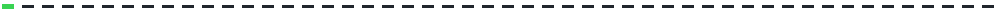
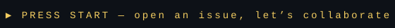

<!-- SHIZAI — pixel workshop profile. All assets are self-contained animated SVGs in ./assets, palette matched to GitHub dark. -->

⚔ quest links: [qwen-code #6250](https://github.com/QwenLM/qwen-code/pull/6250) · [open-design](https://github.com/nexu-io/open-design) · [omnigent](https://github.com/omnigent-ai/omnigent) · [OpenHands SDK](https://github.com/OpenHands/software-agent-sdk)

22.5429°N 114.0596°E · Shenzhen · past the process boundary it's someone else's code — I build the layer that survives it

